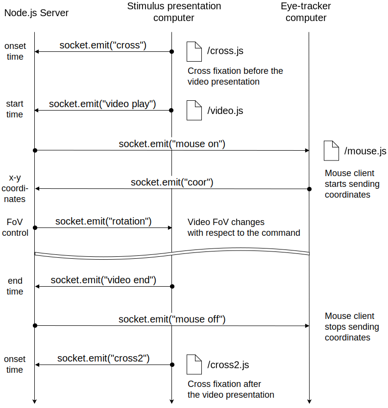
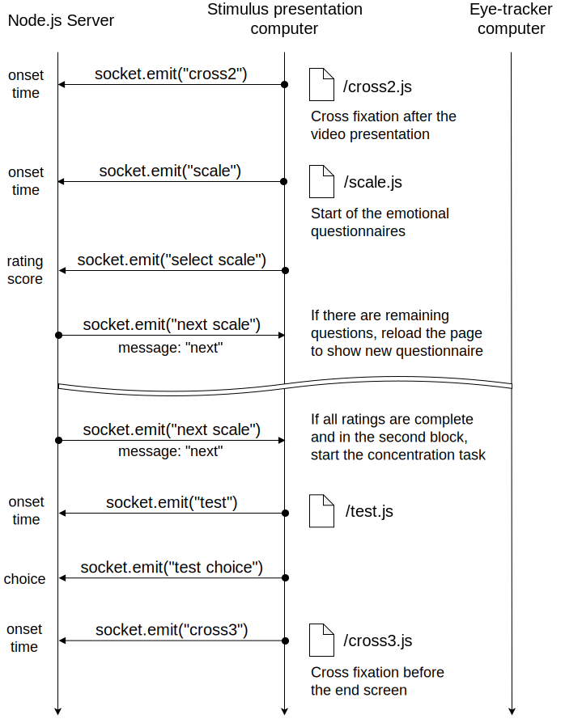

# Eye-tracking based Naturalistic Viewing Paradigm (ENV)
Guide for using our Eye-tracking based Naturalistic Viewing (ENV) Paradigm.

<br>

## Getting Started
### System requirements
**(Stimulus presentation computer)** Microsoft Windows 8.1 or higher

**(Eye-tracker computer)** Microsoft Windows XP or higher

<br>

**NOTE**: We have **only** tested the ENV paradigm code on the two specified OS, Microsoft Windows 8.1 and XP.

**NOTE**: We have tested the ENV paradigm code **only** with *VisualSystem* goggles equipped with the built-in binocular eye-tracker (NordicNeuroLab, Bergen) and the *Viewpoint* eye-tracker software (Arrington Research) which has the "cursor control" functionality.
<br>
<br>

### Software requirements

Node.js >= 8.11.1

- express >= 4.16.3
- pug >= 2.0.3
- readline-sync >= 1.4.9
- system-sleep >= 1.3.6

<br>
**NOTE**: Google Chrome should be installed on both computers.
<br>
<br>

### Installing the required packages

Open a terminal, navigate to the *experimental_setup* directory and run,

```bash
npm install
```

Node.js must be properly installed to run the command.
<br>
<br>
### Preparing video clips

To run our ENV paradigm, you need 360-degree panorama video files.

Because video clips we used in the actual experiment are under  **copyrights** by their creators, we cannot upload the video files directly to the repository.

Rather, we recommend to prepare the videos from the YouTube links below.
<br>
<br>
1. Stargate Media (2015, May 21), Total Solar Eclipse in Svalbard, 2015 (360 Panorama) (https://youtu.be/scL_bXF7k_Q)

2. Realidyne (2015, July 18), Malaekahana Sunrise (360° Video, 4K) (https://youtu.be/-bIrUYM-GjU)

3. J Utah (2016, July 3), Driving Downtown VR 360 - New York City 4K - USA (https://youtu.be/2fDhCPRnndM)

4. Panomenia (2015, March 13), 360° Video - Las Vegas at Night - 4K (https://youtu.be/Jt2kvX7KCE8)


**NOTE**: Prepared videos should be used for the **experimental / non-commercial purpose only** and should **not** be openly distributed.
<br>
<br>

After preparing videos from the links, the videos need to be split into a **equal-length** (we used 210s video clips).

Then encode the resulting clips in a **.mp4 format** and rename the clips like "**1.mp4**", "**2.mp4**", "**3.mp4**", and "**4.mp4**".

Lastly, place edited videos in *experimental_setup/files/vid* directory.


## Usage

This VR experiment setup is designed to run using two computers, the **Eye-tracker computer** and the **Stimulus presentation** computer.


<br>

### LAN cable connection

Therefore, the two computers should be connected via a LAN cable prior to running this script.

After the two computers have been connected, open a terminal on **the stimulus presentation computer** and run,

```bash
ipconfig
```

Memorize the IPv4 address (e.g. 192.168.0.135) under the "Ethernet adapter" section.
<br>
<br>

### Step 1: Run the start script on the *Stimulus presentation computer*

Run the **run.bat** script inside the *experimental_setup* directory by double-clicking it.

A terminal window will appear and ask you to type the subject ID and run number. Type them accordingly.

Once the "Initializations finished successfully. You can now proceed with the experiment" message is shown in the console, you can proceed to the next step.
<br>
<br>

### Step 2: Open Mouse client page on the *Eye-tracker computer*

**NOTE**: If you have done this step in the previous run, simply press the **F5 key** on the web browser to reload the mouse client page and skip this step.
<br>
<br>

Open a web browser(i.e. Google Chrome) and connect to,

```http
[IP_address_of_the_stimulus_presentation_computer]:8000/mouse
```

For example, if your stimulus presentation computer's IP address is *192.168.0.135*, then connect to

```http
192.168.0.135:8000/mouse
```
<Br>
This is an address to connect to the "mouse client page" which will send cursor coordinates to the stimulus presentation computer.


Once connected, a white screen will be loaded and the "### mouse client is loaded ###" message will appear at the terminal on the stimulus presentation computer. 

Afterwards, press **F11 key** to enter full-screen mode and proceed to the next step.
<br>
<br>

### Step 3: Perform eye-tracker calibration on the *Eye-tracker computer*

Plug the VGA cable from the MR-compatible goggles to the **Eye-tracker computer**. 

Switch to the eye-tracker software window (i.e., Viewpoint eye-tracker software) with **Alt-Tab**.

Press the **Auto-Calibration** button to perform eye-tracker calibration.
<br>
<br>

**NOTE**: Make sure that the Mouse client page remains in a full-screen mode when switching the window. 

**NOTE**: We recommend always switching between open windows using Alt-Tab.
<br>
<br>

### Step 4: Run the experimental paradigm on the *Stimulus presentation computer*

Make sure the screen resolution is set to **800 x 600** before starting the experiment.

Plug the VGA cable from the MR-compatible goggles to the **Stimulus presentation computer**.

Check that the mouse client page is properly loaded. 

Return to *experimental_setup* directory (**DO NOT** close the terminal window). Double-click the shortcut named "**Exec the expr**" and press the F11 key to enter full-screen mode.
<br>
<br>

### Step 5: Turn on Cursor control on the Eye-tracker computer

Switch to the eye-tracker software window by Alt-Tab if it is not already switched on.

Turn on cursor control by selecting the menu item (For Viewpoint eye-tracker software, the menu is in **Interface > CursorControl**)

Switch to the web browser using Alt-Tab. Make sure the mouse client page is in a full-screen mode.
<br>
<br>

### Step 6: Start the experiment

Set SyncBox to emit a key response to the stimulus presentation computer once an MRI start signal is received.

You can now start the experiment.

Press **Alt-F4** to close the experimental paradigm window when the end page appears.

Steps 1-6 can be repeated for subsequent runs.
<br>
<br>

**NOTE**: Participants should be instructed in advance to press buttons corresponding to **"3"** and **"4"** keys to decrease / increase the rating score, and press a button corresponding to **"2"** key to select the rating when the emotional questionnaires are shown. 
<br>
<br>

### Changing video clips used in the ENV paradigm

All video clips are located in the *experimental_setup/files/vid* directory. 

Replace the existing four existing video files with newly selected videos.
<br>
<br>

**NOTE**: All video files must be encoded as .mp4 format and named as "1.mp4", "2.mp4", "3.mp4", and "4.mp4".

**NOTE**: Participants with **odd** IDs will view clips "1.mp4" and "3.mp4" in the **Active** condition, and clips "2.mp4" and "4.mp4" in the **Passive** condition. Conversely, participants with **even** IDs will view clips "2.mp4" and "4.mp4" in the **Active** condition, and clips "1.mp4" and "3.mp4" in the **Passive** condition.
<br>
<br>

Initial FoVs (Field of Views) for each clip or candidates of the concentration task may need to be changed.

Open the *experimental_setup/index.js* file with a text editor and update the "*vid_start_rotation*" or "*test_choices*" variables.
<br>
<br>

## Data format

All acquired data files are stored in the *experimental_setup/data* directory. 

A **report file** (filename ends with "_report.txt") is generated at the first run of each subject. First line of a report file stores video clip IDs assigned to each run. Second line represents task block viewing conditions of each video ID. The following lines represent two viewing conditions assigned to each run.

An **etime file** (filename ends with "_etime.etime") is a text file corresponding to each run. It stores timing information of events (instruction onset time, video start/end time, etc) and rating scores from each emotional questionnaire and choice from the concentration task (test).

A **coordinate** file (filename ends with "_coor.txt") is a text file corresponding to each run. It stores timepoints and cursor x-y coordinates sent from the mouse client page.

A **rotation** file (filename ends with "_rotation.txt") is a text file corresponding to each run. It stores timepoints and FoV control commands sent to video page.
<br>
<br>

**NOTE**: In our experimental paradigm, there is unique viewing condition called "Passive" viewing. In the "Passive" condition the report and rotation file from the matching participant are read and the FoVs of the video are controlled automatically. This can be problematic to the first participant whose "matching participant" is unclear. To prevent this issue, we included report and rotation files from our pilot experiment. Therefore, we recommend not to delete / edit the pilot data files inside the *experimental_setup/data* directory. The pilot data files start with "S0_" (Subject ID 0).
<br>
<br>

We recommend integrating the **report file** and **etime files** of each participant into a **csv file** before further data processing. Examples of integrated csv files can be found in the *csv* directory (outside of the *experimental_setup* directory).
<br>
<br>

## Contributing

This project is intended to share our experimental setup code to the public.

If you wish to contribute and update our code, please fork this repository and make changes as see fit.
<br>
<br>

## Diagrams of communication between computers

If you wish to modify or contribute to our ENV paradigm, please refer the communication diagrams between the Node.js sever (i.e., *index.js*) and experimental JavaScript codes on both computers, especially for the two main events: **video presentation** and **emotional questionnaires**.
<br>
<br>

### Video presentation


<br>
<br>

### Emotional questionnaires


<br>
<br>


## Authors

- **Sangsoo, Jin** (@constantjin) - *Developer* - Department of Computer Science, Korea University, Seoul, South Korea
- **Niv Lustig** (@nivlu) - *Reviewer, Editor* - Department of Brain and Cognitive Engineering, Korea University, Seoul, South Korea
- **Junho, Yun** (@somsatang0416) -  *Reviewer, Editor* - Department of Brain and Cognitive Engineering, Korea University, Seoul, South Korea
- **Brain Signal Processing Lab** (http://bspl.korea.ac.kr), Department of Brain and Cognitive Engineering, Korea University, Seoul, South Korea.
<br>
<br>

## License

MIT License

Copyright (c) 2019 Sangsoo, Jin 

Permission is hereby granted, free of charge, to any person obtaining a copy
of this software and associated documentation files (the "Software"), to deal
in the Software without restriction, including without limitation the rights
to use, copy, modify, merge, publish, distribute, sublicense, and/or sell
copies of the Software, and to permit persons to whom the Software is
furnished to do so, subject to the following conditions:

The above copyright notice and this permission notice shall be included in all
copies or substantial portions of the Software.

THE SOFTWARE IS PROVIDED "AS IS", WITHOUT WARRANTY OF ANY KIND, EXPRESS OR
IMPLIED, INCLUDING BUT NOT LIMITED TO THE WARRANTIES OF MERCHANTABILITY,
FITNESS FOR A PARTICULAR PURPOSE AND NONINFRINGEMENT. IN NO EVENT SHALL THE
AUTHORS OR COPYRIGHT HOLDERS BE LIABLE FOR ANY CLAIM, DAMAGES OR OTHER
LIABILITY, WHETHER IN AN ACTION OF CONTRACT, TORT OR OTHERWISE, ARISING FROM,
OUT OF OR IN CONNECTION WITH THE SOFTWARE OR THE USE OR OTHER DEALINGS IN THE
SOFTWARE.

